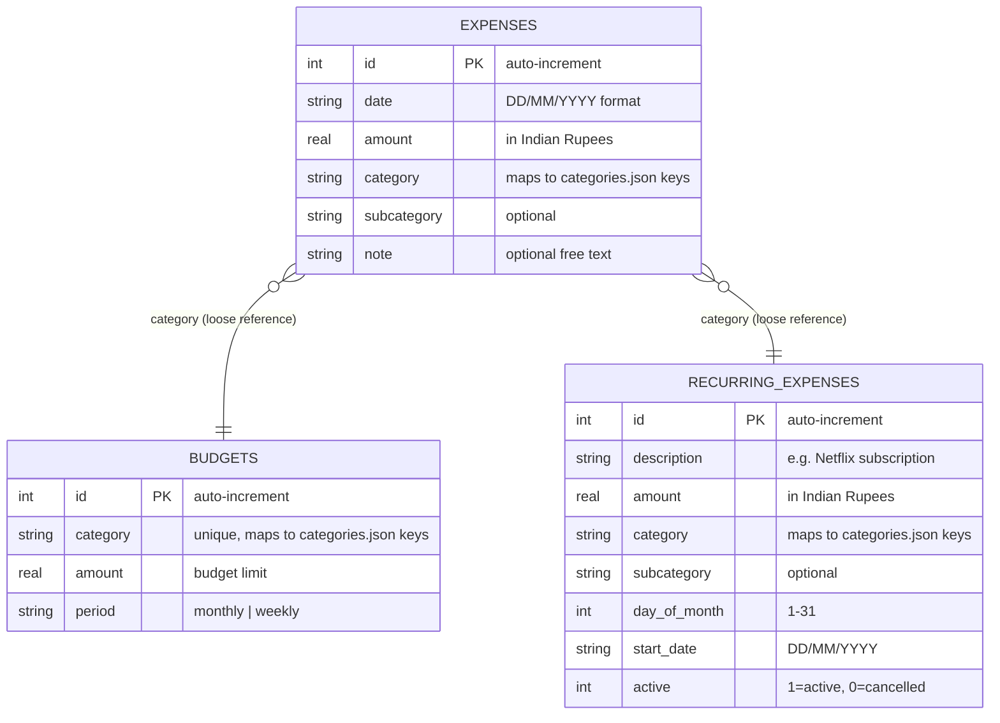

# Data Models

## Entity-Relationship Diagram



> ⚠️ **Note:** The relationships between `expenses`, `budgets`, and `recurring_expenses` are logical (via the `category` string field) rather than enforced by foreign keys. There are no `FOREIGN KEY` constraints in the schema.

---

## `expenses` table

**Purpose:** Stores individual expense records — one row per expense transaction.

**Table name:** `expenses`

| Field | Type | Required | Default | Description |
|-------|------|----------|---------|-------------|
| `id` | INTEGER | yes | auto | Primary key, auto-incremented |
| `date` | TEXT | yes | — | Date in DD/MM/YYYY format (e.g., `11/06/2026`) |
| `amount` | REAL | yes | — | Amount in Indian Rupees (e.g., `350.0`) |
| `category` | TEXT | yes | — | Must match a key in `categories.json` (e.g., `food`, `transport`) |
| `subcategory` | TEXT | no | `''` | Optional subcategory from `categories.json` (e.g., `groceries`) |
| `note` | TEXT | no | `''` | Optional free-text description |

**Validation rules (not enforced by the database):**

- `date` should be a valid calendar date — no format validation exists in code
- `amount` should be positive — no constraint enforces this
- `category` should match a key in `categories.json` — no foreign key or check constraint; this is the LLM's responsibility via the system prompt

**Created by tools:** `add_expense`
**Read by tools:** `get_expense`, `search_expenses`, `list_expenses`, `summarize`, `budget_status`, `export_csv`
**Updated by tool:** `update_expense`
**Deleted by tool:** `delete_expense`

---

## `budgets` table

**Purpose:** Stores budget limits per spending category. A category can have at most one budget row.

**Table name:** `budgets`

| Field | Type | Required | Default | Description |
|-------|------|----------|---------|-------------|
| `id` | INTEGER | yes | auto | Primary key, auto-incremented |
| `category` | TEXT | yes | — | Category name — must be unique across all budgets (UNIQUE constraint enforced by database) |
| `amount` | REAL | yes | — | Budget limit amount in Indian Rupees |
| `period` | TEXT | no | `'monthly'` | Budget period — either `'monthly'` or `'weekly'` |

**Validation rules (not enforced by the database):**

- `category` should match a key in `categories.json` — not enforced by foreign key
- `period` should be `'monthly'` or `'weekly'` — no `CHECK` constraint validates this

**Sequence constraint:** The UNIQUE constraint on `category` means `set_budget` uses an UPSERT pattern: if a budget for the category already exists, it's updated; otherwise, a new row is inserted.

---

## `recurring_expenses` table

**Purpose:** Stores recurring (monthly) expense definitions — subscriptions, EMIs, rent, etc.

**Table name:** `recurring_expenses`

| Field | Type | Required | Default | Description |
|-------|------|----------|---------|-------------|
| `id` | INTEGER | yes | auto | Primary key, auto-incremented |
| `description` | TEXT | yes | — | Name of the recurring expense (e.g., `'Netflix subscription'`) |
| `amount` | REAL | yes | — | Monthly amount in Indian Rupees |
| `category` | TEXT | yes | — | Must match a key in `categories.json` |
| `subcategory` | TEXT | no | `''` | Optional subcategory |
| `day_of_month` | INTEGER | yes | — | Day of month the expense occurs (1–31) |
| `start_date` | TEXT | yes | — | First occurrence date in DD/MM/YYYY format |
| `active` | INTEGER | no | `1` | Status flag: `1` = active, `0` = cancelled |

**Domain state values for `active`:**

| Value | Meaning |
|-------|---------|
| `1` | Active — the recurring expense is currently in effect |
| `0` | Cancelled — the recurring expense has been stopped |

**Validation rules (not enforced by the database):**

- `day_of_month` should be 1–31 — no CHECK constraint
- `start_date` should be a valid date in DD/MM/YYYY format — no format validation

---

## `categories.json` — Domain vocabulary

Not a database table, but the primary source of domain vocabulary. Defines all valid categories and their subcategories:

```
food
  ├── groceries, fruits_vegetables, dairy_bakery, dining_out
  ├── coffee_tea, snacks, delivery_fees, other
transport
  ├── fuel, public_transport, cab_ride_hailing, parking
  ├── tolls, vehicle_service, other
housing
  ├── rent, maintenance_hoa, property_tax, repairs_service
  ├── cleaning, furnishing, other
utilities
  ├── electricity, water, gas, internet_broadband
  ├── mobile_phone, tv_dth, other
health
  ├── medicines, doctor_consultation, diagnostics_labs
  ├── insurance_health, fitness_gym, other
education
  ├── books, courses, online_subscriptions, exam_fees, workshops, other
entertainment
  ├── movies_events, streaming_subscriptions, games_apps, outing, other
shopping
  ├── clothing, footwear, accessories, electronics_gadgets
  ├── appliances, home_decor, other
subscriptions
  ├── saas_tools, cloud_ai, newsletters, music_video, storage_backup, other
personal_care
  ├── salon_spa, grooming, cosmetics, hygiene, other
travel
  ├── flights, hotels, train_bus, visa_passport, local_transport, food_travel, other
investments
  ├── mutual_funds, stocks, fd_rd, gold, crypto, brokerage_fees, other
misc
  ├── uncategorized, rounding, other
```

The `misc` category serves as the fallback — the system prompt instructs the LLM to use `'misc'` if no other category fits.
