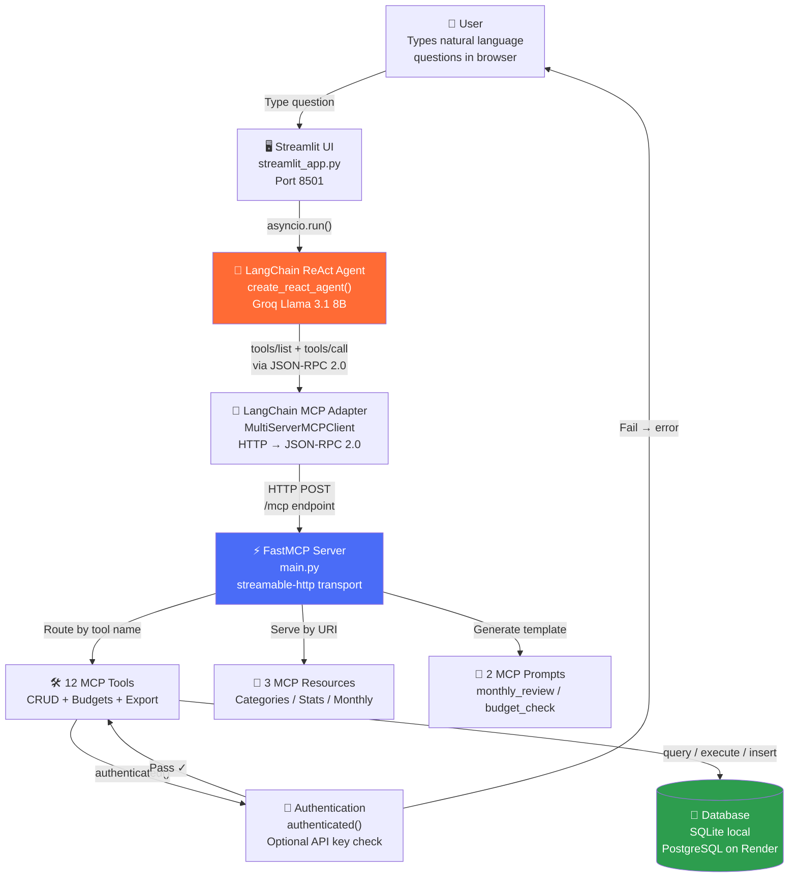

# Architecture Overview

## What the system does

Expense Tracker MCP is a **two-component system**: a backend MCP server that manages expense data, and a frontend AI agent that lets users interact with the server using natural language.

The **MCP Server** (`main.py`) is a Python HTTP server built with FastMCP. It exposes 12 tools (create, read, update, delete expenses; manage budgets; export data), 3 read-only resources (category list, overall stats, monthly breakdown), and 2 prompt templates. It stores data in SQLite (local development) or PostgreSQL (production on Render).

The **Streamlit Frontend** (`streamlit_app.py`) is a web application that runs a LangChain ReAct agent powered by Groq's LLaMA 3.1 model. The agent connects to the MCP server over HTTP, discovers its tools automatically, and calls them on behalf of the user. The UI displays every tool call as a styled card in the sidebar, making the MCP communication visible in real time.

## Architectural pattern

The system follows a **client-server MCP architecture**:

- **Server side**: A FastMCP HTTP server that owns the database and all business logic. It is completely independent of any specific client — any MCP-compatible client (Claude Desktop, custom agents, etc.) can use it.
- **Client side**: A LangChain agent (the "client") that connects to the MCP server, discovers its tools via the `tools/list` MCP method, and calls them via the `tools/call` method. The LLM (Groq) decides *which* tool to call based on the user's natural-language input.

This separation means the data layer and AI layer can be developed, deployed, and scaled independently.

## System diagram

## Directory structure

| Directory / File | Role |
|---|---|
| `main.py` | MCP server: database setup, 12 tools, 3 resources, 2 prompts, HTTP entry point |
| `streamlit_app.py` | Streamlit frontend: chat UI, LangChain agent, tool call visualisation, CSS theme |
| `categories.json` | Valid expense categories and subcategories — read by `expense://categories` resource |
| `pyproject.toml` | Python project metadata and dependency declarations (uv) |
| `requirements.txt` | Legacy dependency list mirroring `pyproject.toml` |
| `Procfile` | Render process declaration: `web: python main.py` |
| `.env` (not committed) | Local secrets: `GROQ_API_KEY`, `MCP_API_KEY` |
| `.python-version` | Python version pin: `3.13` |
| `docs/` | This documentation suite |

## Key design decisions

1. **MCP over HTTP (streamable-http)** — The server is deployed as a remote HTTP endpoint rather than a local subprocess (stdio). This makes it accessible from any network, enables cloud deployment on Render, and demonstrates the remote-MCP pattern that interview questions often cover.

2. **API key as a tool parameter** — Authentication is passed as a regular `api_key` argument to every tool rather than as an HTTP header. This is because the LLM only sees function parameters — it cannot inject HTTP headers. The system prompt tells the LLM to include the key with every call.

3. **Dual database support via `_adapt()`** — The same SQL code works for both SQLite (local) and PostgreSQL (cloud). A single `_adapt()` function transforms SQLite syntax (`?` placeholders, `AUTOINCREMENT`, `LIKE`) to PostgreSQL equivalents (`%s`, `SERIAL`, `ILIKE`). This eliminates the need for an ORM while keeping the codebase portable.

4. **Lazy agent initialisation** — The Streamlit frontend does not connect to the MCP server or build the LangChain agent until the first user question. This reduces startup time and avoids unnecessary network calls if the user never sends a query.

5. **`@json_response` decorator** — All tool return values are automatically JSON-serialised via a decorator rather than manual `json.dumps()` calls. This is necessary because the Groq/OpenAI API requires `ToolMessage.content` to be a plain JSON string.

6. **Tool call logging in session state** — The frontend captures every `on_tool_start` and `on_tool_end` event from the LangChain agent and stores them in Streamlit's session state so the sidebar tool-call log persists across reruns.

## Known limitations and technical debt ⚠️

- **No test files exist.** The repository has zero test coverage.
- **`MCP_URL` is hardcoded** in `streamlit_app.py:24` to the Render deployment URL. To run the frontend against a local server, this must be changed manually.
- **No migration system.** Tables are created via `CREATE TABLE IF NOT EXISTS` on every startup. Schema changes require manual ALTER TABLE statements or dropping and recreating the database.
- **No structured logging.** The server prints to stderr only when `psycopg2` is missing. There is no `logging` module usage, no log levels, and no log aggregation.
- **No rate limiting or concurrency control.** The Streamlit agent uses a single `thread_id` (`"streamlit-demo"`), meaning concurrent conversations would share and overwrite each other's memory.
- **Date stored as text.** Dates are stored as DD/MM/YYYY strings instead of a proper DATE type. This makes date arithmetic (e.g., "last 30 days") awkward and requires LIKE-based pattern matching.
- **No input validation** beyond what the LLM infers from the system prompt. The server does not validate that `date` is a real date, that `amount > 0`, or that `category` matches `categories.json`.
